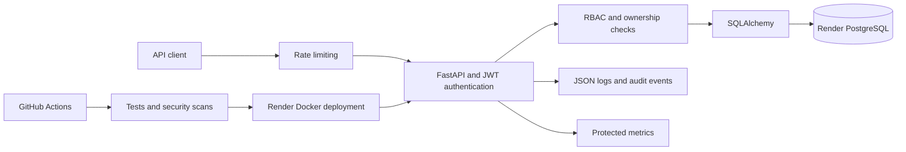
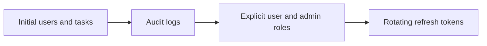
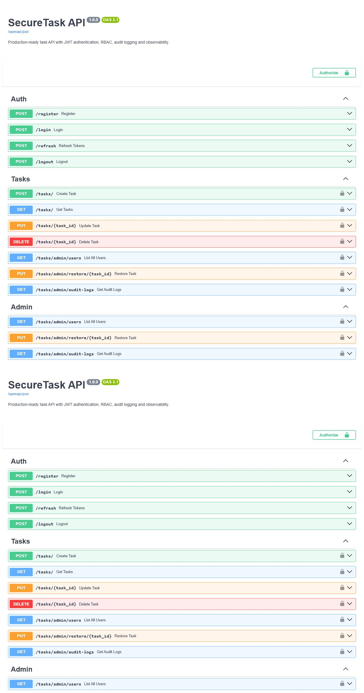

# SecureTask API

[](https://github.com/Learnlife001/SecureTaskAPI/actions/workflows/ci.yml)

[](https://securetask-api-stys.onrender.com/docs)


SecureTask API is a production-oriented FastAPI backend demonstrating secure
API design, PostgreSQL persistence, role-based authorization, automated tests,
observability, containerization, CI/CD and Render deployment automation.

## Architecture



## Production features

- FastAPI and automatically generated OpenAPI/Swagger documentation
- PostgreSQL with SQLAlchemy connection pooling and Alembic migrations
- Short-lived JWT access tokens and rotating refresh tokens
- Logout through server-side refresh-token revocation
- Authentication rate limiting with `Retry-After` responses
- Bcrypt password hashing
- Explicit `user` and `admin` roles plus resource-ownership checks
- Request validation, pagination, soft deletion and audit logging
- Structured JSON logs with request correlation IDs
- Token-protected request count and latency metrics at `/metrics`
- Liveness and database-backed readiness probes
- Non-root Docker image with a container health check
- Unit and API integration tests with a coverage threshold
- GitHub Actions validation against PostgreSQL 16
- Bandit, pip-audit, Trivy and Dependabot security automation
- Render Blueprint deployment with managed PostgreSQL
- Platform-generated production secrets and database credentials

## API endpoints

| Endpoint | Purpose |
| --- | --- |
| `POST /register` | Register a user |
| `POST /login` | Obtain a JWT access token |
| `POST /refresh` | Rotate a refresh token and obtain a new token pair |
| `POST /logout` | Revoke a refresh token |
| `POST /tasks/` | Create a user-owned task |
| `GET /tasks/` | List and filter accessible tasks |
| `PUT /tasks/{id}` | Update an owned task |
| `DELETE /tasks/{id}` | Soft-delete an owned task |
| `GET /tasks/admin/users` | List users as an administrator |
| `GET /tasks/admin/audit-logs` | Review audit events as an administrator |
| `GET /health/live` | Process liveness check |
| `GET /health/ready` | Database readiness check |
| `GET /metrics` | Prometheus-compatible metrics |

Interactive documentation is available at `/docs`; the OpenAPI document is at
`/openapi.json`.

## Local development with Docker

1. Copy `.env.example` to `.env`.
2. Replace `POSTGRES_PASSWORD` and `SECURETASK_SECRET_KEY` with strong values.
3. Ensure the password in `SECURETASK_DATABASE_URL` matches
   `POSTGRES_PASSWORD`.
4. Start the complete environment:

```bash
docker compose up --build
```

The API is available at <http://localhost:8000>. Docker Compose applies Alembic
migrations before the local API begins accepting traffic.

## Local development without Docker

```bash
python -m venv .venv
python -m pip install -r requirements.txt
alembic upgrade head
uvicorn app.main:app --reload
```

Set `SECURETASK_DATABASE_URL` and a secret of at least 16 characters in the
environment before starting the application.

## Testing and quality checks

```bash
pytest --cov=app --cov-report=term-missing --cov-fail-under=80
black --check app tests
docker build -t securetaskapi .
```

The tests use an in-memory SQLite database by default for speed. CI overrides
the database URL with PostgreSQL 16, applies every Alembic migration and then
runs the same test suite.

## Render deployment

The root-level `render.yaml` Blueprint deploys the Docker web service and a
managed PostgreSQL database in Render's Frankfurt region. Render injects the
private database connection string and generates a separate JWT secret for the
production service, so local `.env` values are never uploaded. Database
migrations run as a controlled Render pre-deploy command.

Create a new Blueprint in Render, connect this GitHub repository and select the
root-level `render.yaml`. The API uses `/health/ready` for platform health
checks, and migrations run before the container starts serving requests.

- Live documentation: <https://securetask-api-stys.onrender.com/docs>
- Readiness check: <https://securetask-api-stys.onrender.com/health/ready>

## Database migration history



## Demonstration

Run the automated deployed-API walkthrough:

```bash
python scripts/smoke_test.py
```

It verifies rejected anonymous access, registration, login, task CRUD,
refresh-token rotation and logout without printing credentials or tokens. See
[`docs/DEMO.md`](docs/DEMO.md) for the short video recording guide.



## Security notes

- Never commit `.env`, environment exports or credentials.
- Store production values in Render's encrypted environment variables or an
  external secret manager.
- Keep the metrics token separate from JWT and database credentials.
- Rotate the JWT secret and database credentials according to organizational
  policy.
- Supply the `X-Metrics-Token` header when scraping `/metrics`.
- Run migrations as a controlled deployment job for multi-replica production
  environments.
